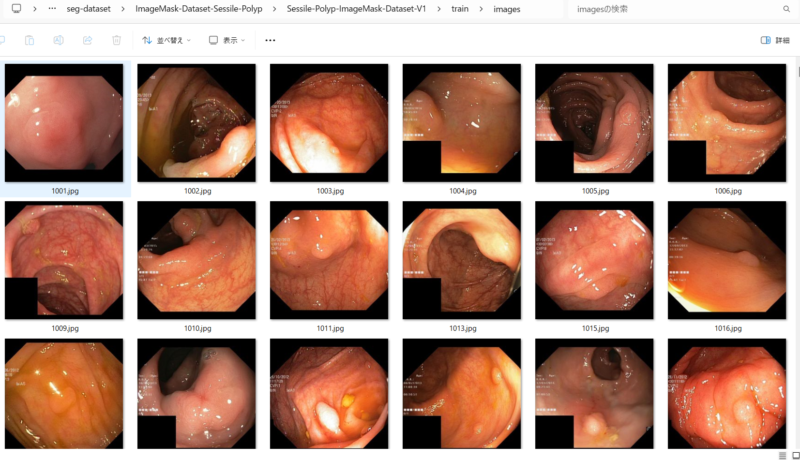

<h2>ImageMask-Dataset-Sessile-Polyp (2024/05/06) </h2>
This is a simple Kvasir-Sessile dataset (Sessile polyps from Kvasir-SEG) for Image-Segmentation. 
The original dataset used here has been taken from the web-site. 

<a href="https://paperswithcode.com/dataset/kvasir-sessile-dataset">
Kvasir-Sessile dataset (Sessile polyps from Kvasir-SEG)
</a>
 
<b>Download Sessile-Polyp-ImageMask-Dataset-</b> 
 
You can download our augmented dataset generated here from the google drive 
<a href="https://drive.google.com/file/d/1ASU3q3tp4Benvu4_4O7Fx5eZaRdD1Dr_/view?usp=sharing">Sessile-Polyp-ImageMask-Dataset-V1</a>.
 

 
<b>Image and mask sample</b> 

<table>
<tr>
<th>
Image 
</th>
<th>
Mask
</th>
</tr>
<tr>
<td>

</td>
<td>

</td>
</tr>

<tr>
<td>

</td>
<td>

</td>
</tr>
</table>

<h3>1. Dataset Citation</h3>
<b>
Kvasir-Sessile dataset (Sessile polyps from Kvasir-SEG)  
Introduced by Jha et al. in Kvasir-SEG: A Segmented Polyp Dataset 
</b>
<pre>
The Kvasir-SEG dataset includes 196 polyps smaller than 10 mm classified as Paris class 1 
sessile or Paris class IIa. We have selected it with the help of expert gastroenterologists. 
We have released this dataset separately as a subset of Kvasir-SEG. We call this subset Kvasir-Sessile.

The dataset is publicly available. It can be downloaded from here:

https://drive.google.com/drive/folders/1OjsStQh6yuKz0bG6OA3BzmIiXDZILg7V?usp=sharing

If you use this dataset, please cite our paper,

https://ieeexplore.ieee.org/stamp/stamp.jsp?tp=&arnumber=9314114

/https://arxiv.org/pdf/1911.07069.pdf

</pre>

<h3>2. Download Lung dataset </h3>
If you would like to create your own dataset by yourself,
please download the original <b>sessile-main-Kvasir-SEG</b> dataset from the
google drive 

Please expand the downloaded tar file under <b>ImageMask-Dataset-Sessile-Polyp</b> directory, 
<pre>
./ImageMask-Dataset-Sessile-Polyp
 └─sessile-main-Kvasir-SEG
    ├─images
    └─mask
</pre>

<h3>3. Generate master dataset </h3>
Please run the following commnad for Python script <a href="./ImageMaskDatasetGenerator.py">ImageMaskDatasetGenerator.py</a> to generate
images and masks jgp files. 
<pre>
>python ImageMaskDatasetGenerator.py 
</pre>
, by which the following images and masks datasets of 512x512 pixel-size will be created under <b>Sessile-Polyp-master</b> directory,
by flipping, rotating, and distorting image augmentation processings. 
<pre>
./Sessile-Polyp-master
  ├─images
  └─masks
</pre>

<h3>4. Split master dataset </h3>
Please run the following command for Python script <a href="./split_master.py">split_master.py</a>.
<pre>
>python split_master.py
</pre>
, by wich test, train, and valid subdatasets will be created. 

<pre>
./Sessile-Polyp-ImageMask-Dataset-V1
├─test
│  ├─images
│  └─masks
├─train
│  ├─images
│  └─masks
└─valid
    ├─images
    └─masks
</pre>

Train images sample 
 
Train masks sample 
 

Dataset Statistics  

 

